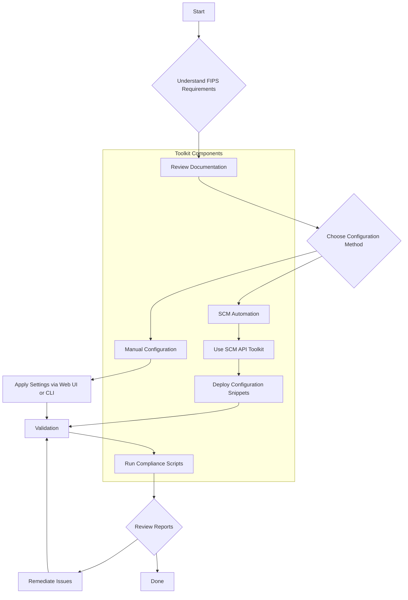

# FIPS 140-3 Toolkit Infographics

Visual guides for engineers to understand and implement FIPS 140-3 compliance using this toolkit.

## Available Infographics

### 1. Toolkit Overview
**File:** [`fips-140-3-toolkit-overview.svg`](./fips-140-3-toolkit-overview.svg)

A comprehensive single-page visual covering:
- Three compliance tiers (max, recommended, compat)
- Dual deployment paths (On-Premises vs SCM Cloud)
- Four cryptographic domains (IKE, IPSec, SSL/TLS, SSH)
- Validation workflow and result states
- Directory structure quick reference
- Approved vs non-compliant algorithm lists

### 2. Engineer's Workflow
**File:** [`engineer-workflow.svg`](./engineer-workflow.svg)

Step-by-step visual workflow showing:
1. **Plan & Assess** - Review requirements, choose deployment model, select tier
2. **Configure** - Apply crypto profiles using CLI/API/SDK
3. **Validate** - Run compliance checks, review results
4. **Deploy** - Commit (NGFW) or push config (SCM)
5. **Monitor** - Ongoing compliance, CI/CD integration

---

## Workflow Overview (Mermaid)



---

## Directory Structure At-a-Glance

```
fips-140-3-toolkit-share/
├── 00-overview/              # FIPS 140-3 concepts
├── 01-ipsec-ike/             # IKE/IPSec crypto profiles
├── 02-ssl-tls/               # TLS/SSL service profiles
├── 03-ssh/                   # SSH hardening
├── 04-admin-web-interface/   # Management interface TLS
├── 05-strata-cloud-manager/  # SCM snippets
├── 06-verification-scripts/  # Manual verification docs
├── 07-api-reference/         # PAN-OS API reference
├── 08-validation-tools/      # Automated validators
│   ├── fips-compliance-validator.py
│   └── fips-compliance-validator.sh
├── 09-scm-api-toolkit/       # SCM API automation
│   ├── 06-python-sdk/        # Python client library
│   └── 07-examples/          # Working examples
├── snippet-configs/          # Ready-to-use JSON configs
└── infographic/              # Visual guides (you are here)
```

---

## Quick Reference

### Compliance Tiers

| Tier | Encryption | Hash | DH Group | Use Case |
|------|------------|------|----------|----------|
| **max** | AES-256-GCM | SHA-512 | Group 20 | Government, high-security |
| **recommended** | AES-256/128-GCM/CBC | SHA-384/256 | Group 19/20 | Production environments |
| **compat** | Multiple AES | SHA-2 family | Groups 14-21 | Legacy integration |

### Validation Results

| Status | Exit Code | Meaning |
|--------|-----------|---------|
| PASSED | 0 | All settings compliant |
| HIGH RISK | 2 | Non-compliant profiles exist but not in use |
| FAILED | 1 | Non-compliant settings actively in use |

### FIPS-Approved vs Non-Compliant

**Use These (Approved):**
- Encryption: AES-128/192/256-CBC, AES-128/256-GCM
- Hash: SHA-256, SHA-384, SHA-512
- DH Groups: 14, 15, 16, 19, 20, 21
- TLS: 1.2, 1.3

**Remove These (Non-Compliant):**
- Encryption: 3DES, DES, NULL, RC4
- Hash: MD5, SHA-1
- DH Groups: 1, 2, 5, no-pfs
- TLS: 1.0, 1.1

---

## Getting Started

1. **Understand the requirements** - Review `00-overview/` documentation
2. **Choose your path**:
   - **On-Premises**: Follow guides in `01-04/` directories
   - **SCM Cloud**: Use `09-scm-api-toolkit/` and `snippet-configs/`
3. **Configure** - Apply FIPS-compliant crypto profiles
4. **Validate** - Run `08-validation-tools/fips-compliance-validator.py`
5. **Remediate** - Fix any issues, re-validate
6. **Deploy** - Commit or push configuration
7. **Monitor** - Schedule periodic compliance checks

---

## Key Value Proposition

> **Standard FIPS compliance** requires enabling CC-mode, which necessitates factory resets and imposes operational restrictions.
>
> **This toolkit** enables selective cryptographic hardening - achieving FIPS 140-3 compliance while maintaining full feature availability WITHOUT CC-mode.

---

For detailed instructions, see the main [README.md](../README.md) or specific documentation in each directory.
